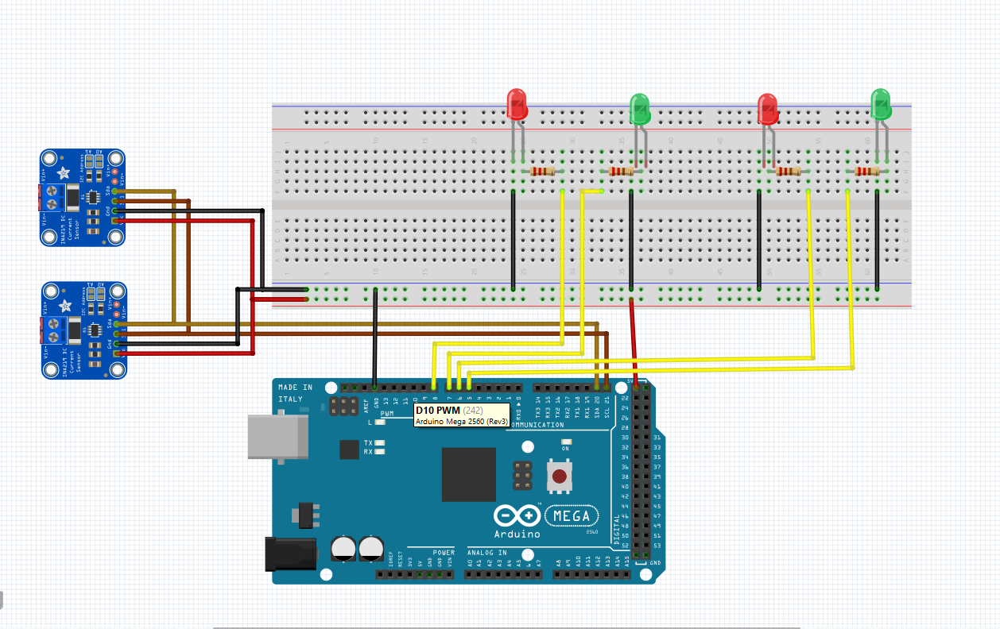

### Circuit Diagram
using [Fritzing](https://fritzing.org/home/)
use the [Fritzing](https://fritzing.org/home/) to open the `Circuit.fzz` file
## Config pin in Arduino
```c++

/*----------------- SET OUTPUT 1-----------------*/
#define PIN_LED_GREEN_1 5
#define PIN_LED_RED_1 6

TcPINOUT LED_GREEN_1(PIN_LED_GREEN_1);
TcPINOUT LED_RED_1(PIN_LED_RED_1);
/*----------------- SET OUTPUT 1-----------------*/
#define PIN_LED_GREEN_2 7
#define PIN_LED_RED_2 8
TcPINOUT LED_GREEN_2(PIN_LED_GREEN_2);
TcPINOUT LED_RED_2(PIN_LED_RED_2);
/*----------------- SET INPUT VOLTAGE 1-----------------*/
#define PIN_VL_1 A0
/*----------------- SET INPUT VOLTAGE 2-----------------*/
#define PIN_VL_2 A1
/*----------------- VARIABLES -----------------*/

```

### Circuit Diagram Image
<!-- Image Center -->
<p align="center">
  
</p>